# hello_flutter

A new Flutter project.

## Getting Started

This project is a starting point for a Flutter application.

A few resources to get you started if this is your first Flutter project:

# Tasks done by me are:
### 1. Download and install Flutter SDK 

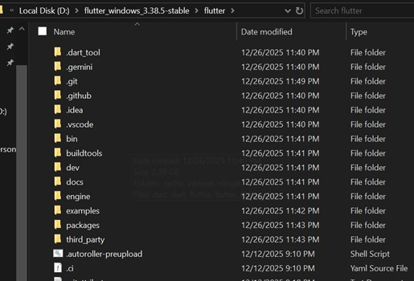

### 2. Add Flutter to PATH 

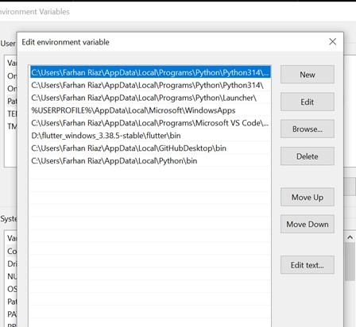

### 3. Run flutter doctor 

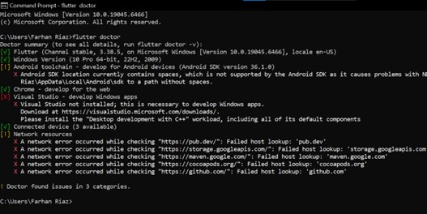

### 4. Install Android Studio 

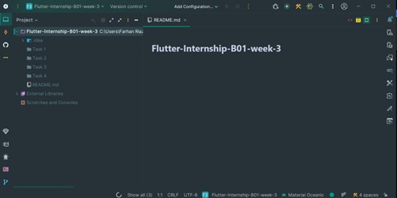

### 5. Install VS Code with Flutter extension 

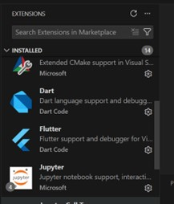

### 6. Run flutter create hello_flutter 

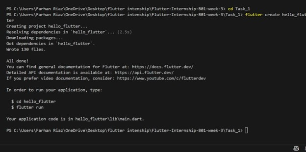

### 7. Explore lib/, android/, ios/ folders 

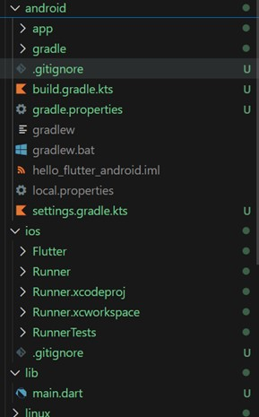

### 8. Open in VS Code 

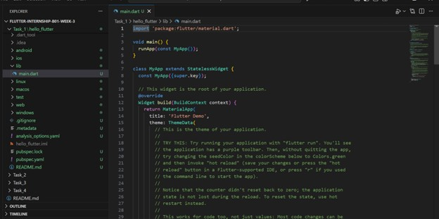

### 9. Modify MaterialApp title and theme 

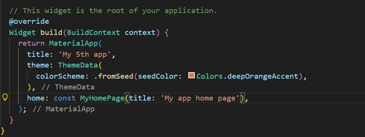

### 10. Change Text widget content 

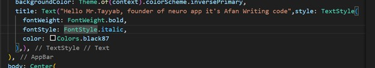

### 11. Run flutter run 

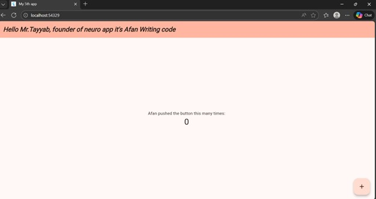
