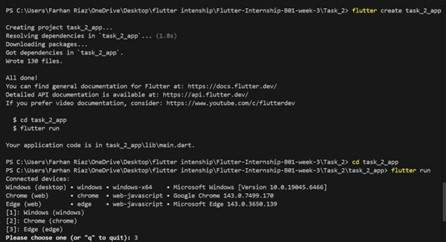
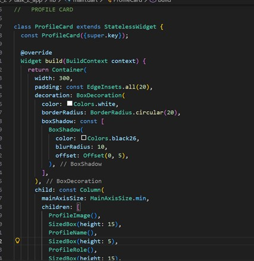
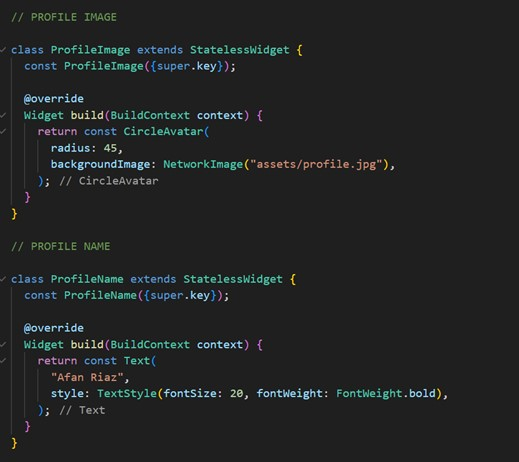
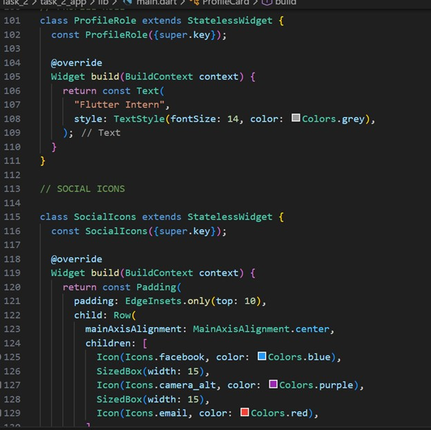
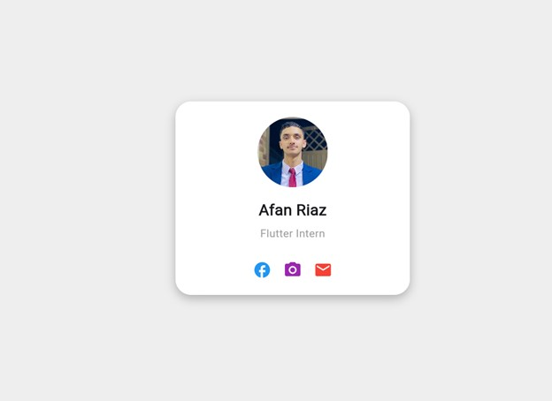

# task_2_app

A new Flutter project.

## Getting Started

This project is a starting point for a Flutter application.

A few resources to get you started if this is your first Flutter project:

### 1. Create new Flutter project 

### 2. Create ProfileCard class extending StatelessWidget 
### 3. Use Container with BoxDecoration 
### 4. Add borderRadius and boxShadow 
### 5. Use Column for vertical layout 

### 6. Add CircleAvatar with NetworkImage 
### 7. Add Text widgets with custom TextStyle 

### 8. Use Row for social media icons 
### 9. Add Icon widgets 
### 10. Implement Padding and SizedBox for spacing 

### 11. Create separate widget classes for sections
### 12. Run and screenshot UI 

