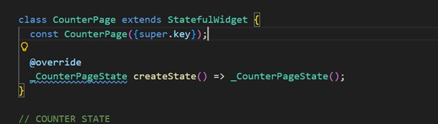
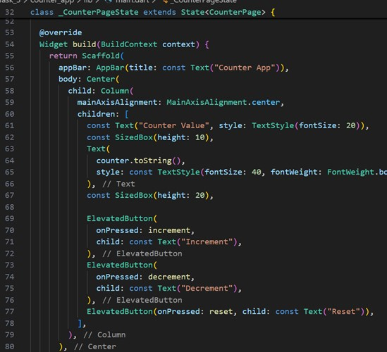
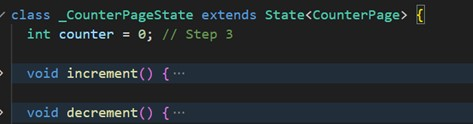
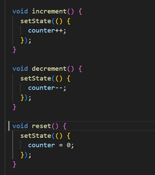
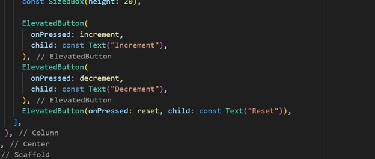
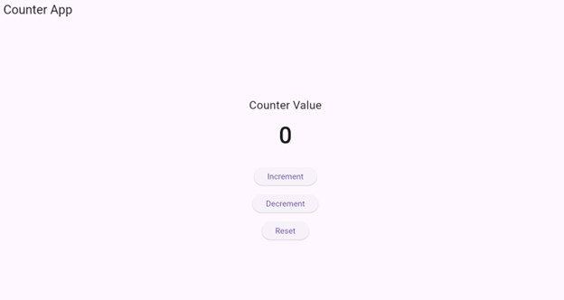

# counter_app

A new Flutter project.

## Getting Started

This project is a starting point for a Flutter application.

A few resources to get you started if this is your first Flutter project:

### 1. Create CounterPage class extending StatefulWidget 

### 2. Create _CounterPageState class 

### 3. Declare int counter = 0 

### 4. Implement increment(), decrement(), reset() 

### 5. Use setState() to update UI 

### 6. Add ElevatedButton widgets 

## App UI

