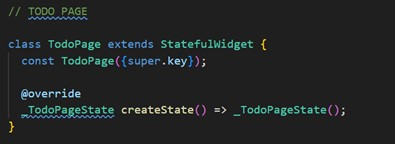
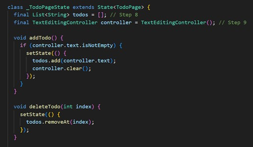
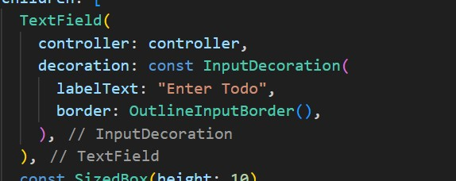
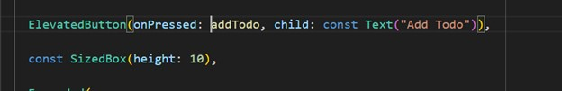
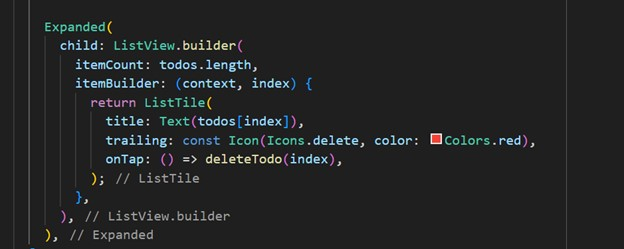
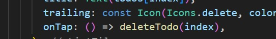
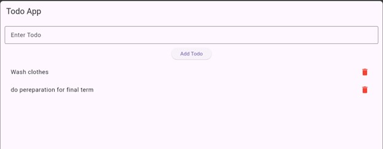

# todo_app

A new Flutter project.

## Getting Started

This project is a starting point for a Flutter application.

A few resources to get you started if this is your first Flutter project:

### 1. Add ElevatedButton widgets 

### 2. Create TodoPage with StatefulWidget 

### 3. Create List<String> todos 

### 4. Add TextEditingController for input 

### 5. Implement addTodo() function 

### 6. Build ListView.builder() for displaying todos 

### App UI

