# navigation_app

A new Flutter project.

## Getting Started

This project is a starting point for a Flutter application.

A few resources to get you started if this is your first Flutter project:

### 1. Create new Flutter project 

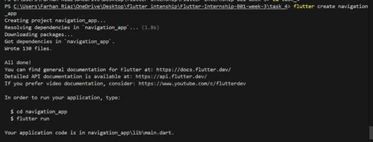

### 2. Create HomeScreen class 

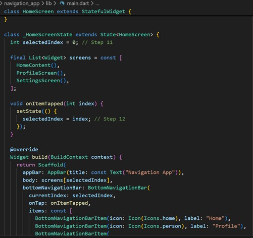

### 3. Create ProfileScreen class 

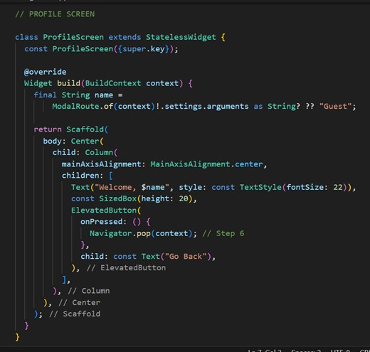

### 4. Create SettingsScreen class 

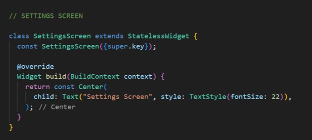

### 5. Implement Navigator.push() to navigate 

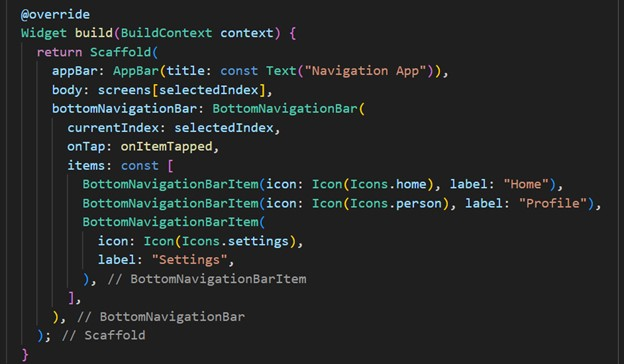

### 6. Use Navigator.pop() to go back 

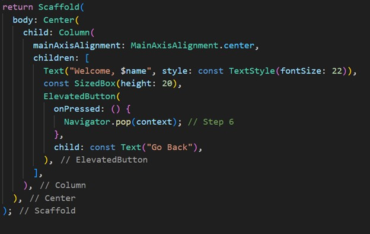

### 7. Define named routes in MaterialApp 

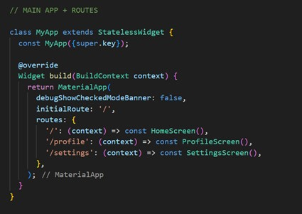

### 8. Use Navigator.pushNamed() 

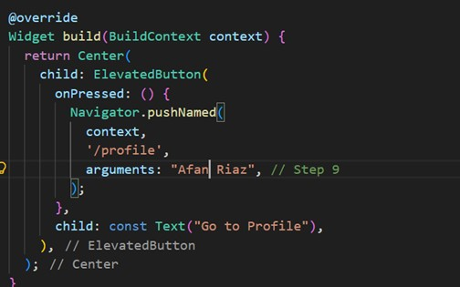

### 9. Pass data with ModalRoute.of(context).settings.arguments 

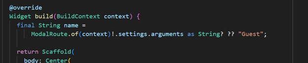

### 10. Create BottomNavigationBar 

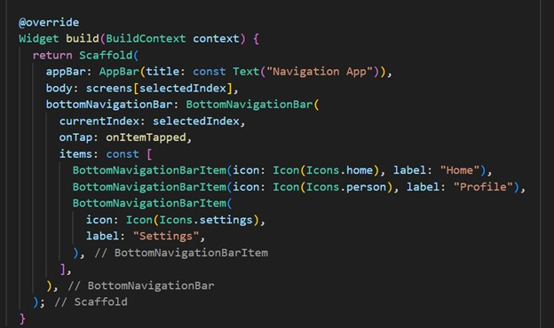

### 11. Manage selected index with setState() 

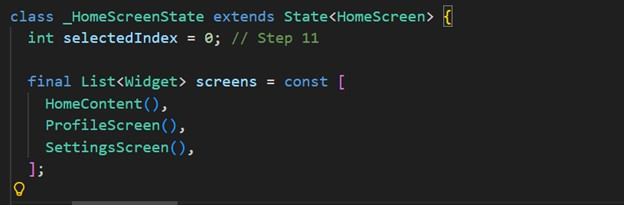

### 12. Switch between screens based on index

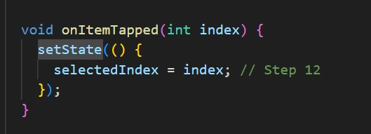

## App UI

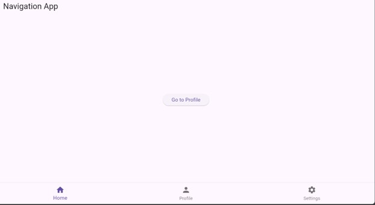
